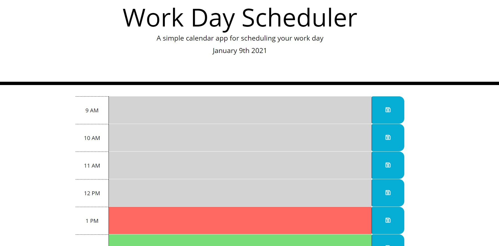
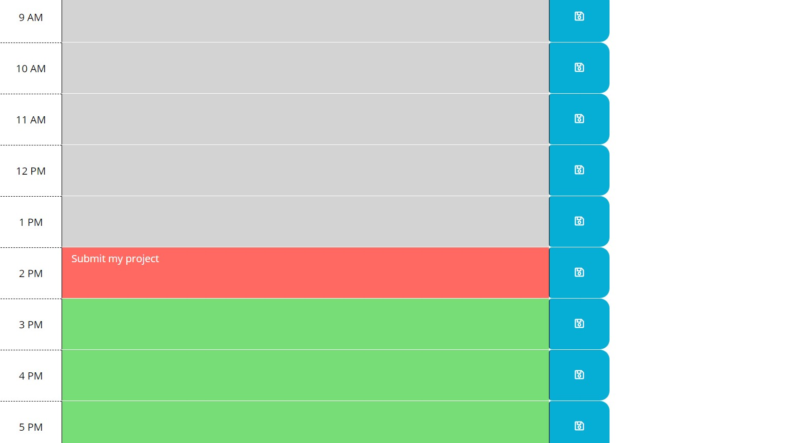

# day-scheduler
 I created an application that allows a user to save events for each hour of the day. Every hour block will be colored to let user know if it is a past,present or future event.
## Languajes
 Java Script with HTML,CSS,Bootstrap and JQuery.
#  link
The page can be found at:
<a href="https://martha121.github.io/day-scheduler/"> martha121.github.io/day-scheduler</a>

# Screenshot
Screenshot of main page 

Screenshot of event being saved after page is refreshed:
